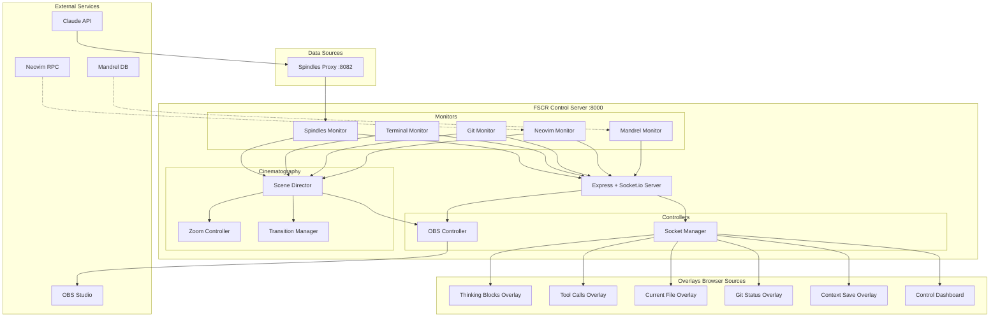

# Forge Studio Control Room (FSCR) - Architecture & Plan

## Project Overview

**Mandrel Project:** `forge-studio`
**Working Directory:** `~/aidis/projects/forge-live/forge-studio/`
**Purpose:** Central orchestration hub for AI-native streaming with automated cinematography and real-time visualization

## Core Concept

FSCR is the "central nervous system" that coordinates all aspects of the streaming system:
- Captures AI thinking blocks from Claude API (via spindles-proxy)
- Controls OBS automation (scenes, zoom, transitions)
- Manages real-time overlays (thinking blocks, git, file tracking, context saves)
- Monitors development activity (terminal, Neovim, git)
- Integrates with Mandrel context database

## Architecture Overview



## File Structure

```
forge-studio/
├── src/
│   ├── server.ts                      # Main Express + Socket.io server
│   ├── controllers/
│   │   ├── ObsController.ts           # OBS websocket automation
│   │   └── SocketManager.ts           # Overlay communication hub
│   ├── monitors/
│   │   ├── TerminalMonitor.ts         # Terminal output monitoring
│   │   ├── GitMonitor.ts              # Git activity tracking
│   │   ├── NeovimMonitor.ts           # Neovim RPC integration
│   │   ├── SpindlesMonitor.ts         # Thinking blocks from proxy
│   │   └── ErrorDetector.ts           # Error pattern detection
│   ├── cinematography/
│   │   ├── SceneDirector.ts           # Automated scene switching
│   │   ├── ZoomController.ts          # Smart zoom control
│   │   └── TransitionManager.ts       # Smooth transitions
│   ├── ai-monitors/
│   │   ├── ClaudeInterceptor.ts       # Claude API monitoring
│   │   ├── ThinkingExtractor.ts       # Extract thinking blocks
│   │   └── LocalLlmClient.ts          # Ollama integration
│   ├── mandrel-integration/
│   │   ├── DbMonitor.ts               # Mandrel DB event tracking
│   │   └── ContextTracker.ts          # Context save/retrieval
│   ├── audio/
│   │   └── AudioManager.ts            # Audio cue system
│   ├── config/
│   │   └── config.ts                  # Configuration management
│   └── types/
│       └── events.ts                  # TypeScript event types
├── public/
│   ├── dashboard/                     # Control dashboard UI
│   │   ├── index.html
│   │   ├── style.css
│   │   └── script.js
│   ├── overlays/                      # OBS browser sources
│   │   ├── thinking-blocks/
│   │   ├── tool-calls/
│   │   ├── current-file/
│   │   ├── git-status/
│   │   ├── context-save/
│   │   ├── conversation-summary/
│   │   └── error-explanation/
│   └── sounds/                        # Audio cue files
│       ├── thinking-start.wav
│       ├── tool-call.wav
│       ├── error.wav
│       ├── commit.wav
│       └── context-save.wav
├── config/
│   ├── default.json                   # Default configuration
│   ├── production.json                # Production settings
│   └── development.json               # Development settings
├── docs/
│   ├── FORGE-STUDIO-MASTER-PLAN.md
│   ├── FSCR-ARCHITECTURE.md
│   ├── FORGE-STUDIO-WISH-LIST.md
│   └── WEEK-1-QUICK-START.md
├── package.json
├── tsconfig.json
├── .env
├── .gitignore
└── README.md
```

## Phase 1: Foundation & Control Server (Current)

**Goal:** Build the central nervous system - prove we can control OBS and communicate with overlays

### 1.1 Control Server Setup ✅ NEXT

**Deliverables:**
- [ ] Express + Socket.io server running on localhost:8000
- [ ] Successfully connect to OBS websocket (localhost:4455)
- [ ] Can switch scenes programmatically
- [ ] Can emit test messages to browser source overlay
- [ ] Simple web dashboard showing connection status

**Key Dependencies:**
```json
{
  "dependencies": {
    "express": "^4.18.2",
    "socket.io": "^4.6.1",
    "obs-websocket-js": "^5.0.3",
    "dotenv": "^16.0.3"
  },
  "devDependencies": {
    "@types/express": "^4.17.17",
    "@types/node": "^20.0.0",
    "typescript": "^5.0.0",
    "tsx": "^4.0.0",
    "nodemon": "^3.0.0"
  }
}
```

### 1.2 Basic OBS Setup

**Scenes to Create:**
- `CODE_EDITOR` - Neovim in terminal, full screen
- `TERMINAL_FOCUS` - Terminal output, zoomed
- `OVERVIEW` - Split view: editor + overlays
- `THINKING` - Full overlay showcase (thinking blocks, context)

**Browser Sources:**
- `http://localhost:8000/overlay/thinking-blocks`
- `http://localhost:8000/overlay/tool-calls`
- `http://localhost:8000/overlay/current-file`
- `http://localhost:8000/overlay/git-status`

### 1.3 First Overlay: Thinking Blocks

**Integration with Existing Work:**
- Reuse spindles-viewer HTML/CSS/JS
- Connect to FSCR Socket.io instead of direct SSE
- spindles-proxy feeds data to FSCR
- FSCR broadcasts to all overlay clients

**Socket Event Structure:**
```typescript
interface ThinkingBlockEvent {
  type: 'thinking_block';
  content: string;
  blockType: 'reasoning' | 'planning' | 'reflection';
  timestamp: string;
  sessionId: string;
  tokenCount: number;
}
```

## Integration Points

### Spindles Proxy Integration
```typescript
// spindles-proxy sends data to FSCR
const FSCR_ENDPOINT = 'http://localhost:8000/api/spindles';

// FSCR receives and broadcasts to overlays
app.post('/api/spindles', (req, res) => {
  const spindle = req.body;
  socketManager.broadcastThinkingBlock(spindle);
  res.json({ success: true });
});
```

### Mandrel Integration
```typescript
// Monitor Mandrel DB operations
class MandrelMonitor {
  onContextSaved(context: Context) {
    socketManager.broadcastContextSave({
      type: 'context_save',
      preview: context.content.substring(0, 100),
      tags: context.tags,
      timestamp: new Date().toISOString()
    });
  }

  onContextRetrieved(query: string, results: Context[]) {
    socketManager.broadcastContextRetrieval({
      type: 'context_retrieval',
      query,
      resultCount: results.length,
      topSimilarity: results[0]?.similarity
    });
  }
}
```

## Configuration

```json
{
  "obs": {
    "host": "localhost",
    "port": 4455,
    "password": ""
  },
  "server": {
    "port": 8000,
    "host": "localhost"
  },
  "neovim": {
    "host": "localhost",
    "port": 6666
  },
  "spindles": {
    "proxyPort": 8082,
    "viewerPort": 3737
  },
  "mandrel": {
    "dbUrl": "postgresql://ridgetop@localhost:5432/aidis_production",
    "mcpPort": 8080
  },
  "automation": {
    "sceneSwitchCooldown": 5000,
    "zoomIntensity": 1.5,
    "errorAnalysisEnabled": true
  },
  "audio": {
    "enabled": true,
    "volume": 0.3
  },
  "monitors": {
    "terminal": true,
    "neovim": true,
    "git": true,
    "spindles": true,
    "mandrel": true
  }
}
```

## Development Workflow

### Starting the System
```bash
# Terminal 1: FSCR Control Server
cd ~/aidis/projects/forge-live/forge-studio
npm run dev

# Terminal 2: Spindles Proxy (existing)
cd ~/aidis/spindles-proxy
npm start

# Terminal 3: OBS Studio
obs

# Terminal 4: Neovim with RPC
nvim --listen localhost:6666
```

### Testing Flow
1. Start FSCR control server → confirms OBS connection
2. Open dashboard at http://localhost:8000
3. Open overlay at http://localhost:8000/overlay/thinking-blocks
4. Start Claude conversation → spindles-proxy captures thinking
5. spindles-proxy sends to FSCR → FSCR broadcasts to overlay
6. Verify thinking blocks appear in real-time

## Future Phases (Post Phase 1)

**Phase 2:** Development Activity Monitoring (Terminal, Neovim, Git)
**Phase 3:** AI Reasoning Extraction (Enhanced thinking blocks, tool calls)
**Phase 4:** Mandrel Context Integration (Context saves, retrieval notifications)
**Phase 5:** Automated Cinematography (Scene director, zoom automation)
**Phase 6:** Error Intelligence & Audio (LLM error analysis, audio cues)
**Phase 7:** Polish & Optimization
**Phase 8:** Testing & Launch

## Key Design Principles

1. **Single Source of Truth:** FSCR controls everything
2. **Event-Driven:** All monitors emit events, director reacts
3. **Modular:** Each monitor/overlay can be enabled/disabled
4. **Transparent:** Overlays are pure display, no business logic
5. **Resilient:** Failed monitors don't crash the system
6. **Observable:** Dashboard shows all system activity
7. **Configurable:** All behavior controlled via config files

## Success Metrics

After Phase 1 completion:
✅ FSCR running and stable
✅ OBS connection working
✅ Can switch scenes programmatically
✅ Thinking blocks overlay functional
✅ spindles-proxy integrated
✅ Dashboard shows system status
✅ Ready to add more monitors/overlays

---

**Status:** Phase 1.1 - Ready to build control server foundation
**Next Step:** Initialize Node.js/TypeScript project and create server.ts
